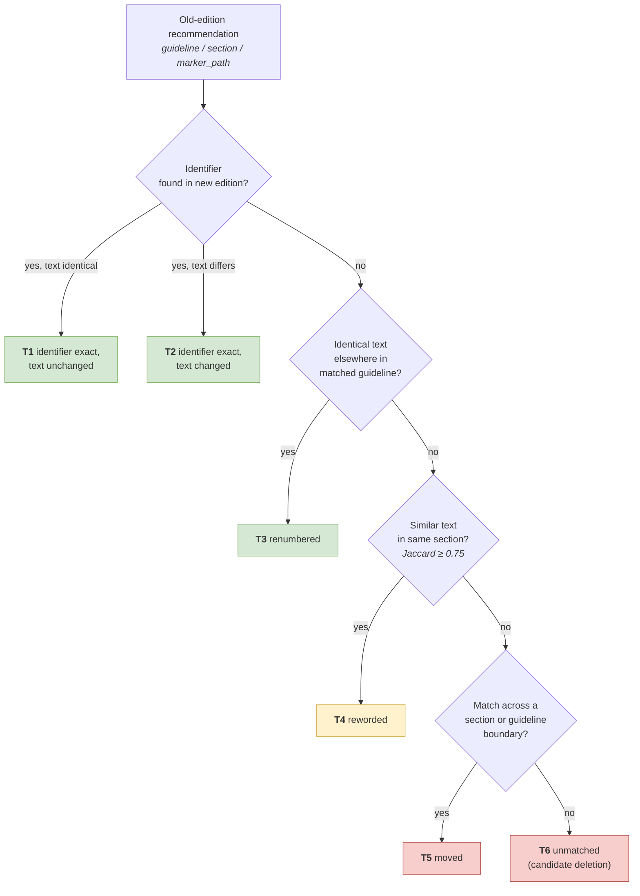
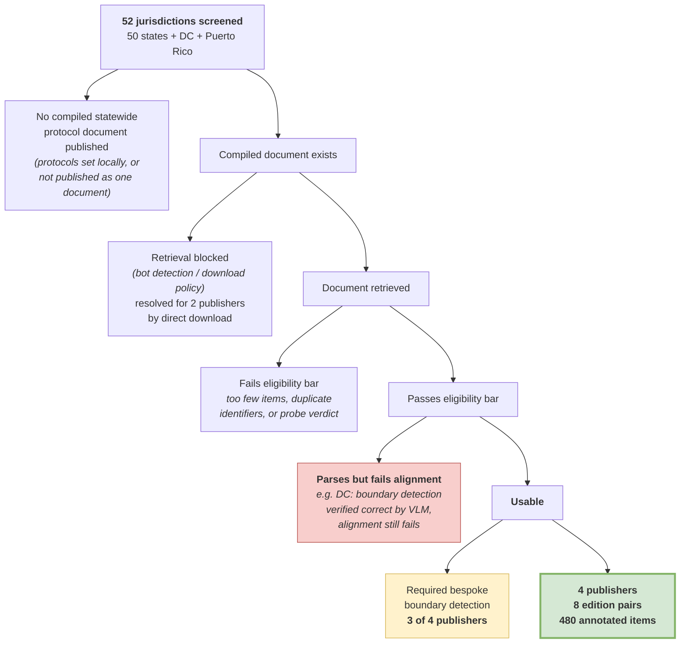

# Where did this recommendation go? A pre-registered evaluation of cross-edition provenance recovery in state EMS clinical protocols

**Target venue:** *Journal of the American Medical Informatics Association* (JAMIA), Research and Applications
**Format:** structured abstract ≤250 words; main text ≤4,000 words; ≤4 tables; ≤6 figures; CRediT contributions; mandatory data-availability statement
**Draft status:** complete scientific draft. Author list, Related Work citations, and venue formatting are marked `[AUTHOR]` — these require input that cannot be supplied without fabricating scholarly claims, and are deliberately left blank rather than invented.

---

## Structured abstract

**Objective.** When a clinical protocol set is republished, individual recommendations are renumbered, reworded, merged, split, moved, and deleted with no machine-readable change log. We asked whether a structure-aware alignment method can recover, for a recommendation in edition *N*, its counterpart in edition *N+1*, and pre-registered the evaluation before any test document was retrieved.

**Materials and Methods.** We pre-registered hypotheses, metrics, baselines, and abort conditions, and froze the pipeline for the confirmatory phase. The test set comprised 8 consecutive-edition pairs from 4 independent U.S. state EMS publishers, none used during development. From each pair we drew a stratified sample of 60 recommendations across six correspondence tiers (480 items). Two annotators blind to system output labelled every item; disagreements were adjudicated. Comparisons used paired bootstrap 95% confidence intervals with Benjamini–Hochberg correction.

**Results.** Pooled provenance loss (pre-registered primary outcome) was 2.50% population-weighted (12.11% raw; n=380). Annotator agreement was κ=0.69–1.00. The method showed no reliable accuracy advantage over a text-only baseline (H3: −0.0064, 95% CI −0.0384 to 0.0277). Renumbered-item precision was 98.2% (H4, confirmed). A hypothesis added late, but with its criterion and test set fixed before testing, held: moved items are unreliably recovered (H6: 0/10; 6.7% pooled, n=60).

**Discussion.** Structural scoping did not outperform simpler baselines, but substantially outperformed the identifier lookup current practice relies on (38.17% vs 10.75% provenance loss). The deficit localises to the fuzzy matching tiers, and specifically to moved items.

**Conclusion.** Cross-edition provenance is recoverable, but one identifiable component fails almost completely and needs human review.

*(247 words; JAMIA limit 250)*

---

## Background and Significance

Clinical protocol sets — the documents that tell a paramedic what dose to give, in what order, and when to stop — are republished as whole documents. Edition *N+1* arrives as a fresh PDF. Recommendations inside it have been renumbered, reworded, merged, split, promoted between sections, added, and silently removed. There is no amendment instruction, no guaranteed change log, and no identifier that is stable by construction.

This distinguishes the problem from legislative amendment tracking, where bills carry machine-readable amendatory instructions ("strike X, insert Y") and correspondence between versions is *given* rather than inferred. In clinical protocols it must be recovered from content and structure alone.

The consequence is operational, not merely bibliographic. An institution that cannot trace a recommendation across its own editions cannot answer *when did we change this, and why*; cannot distinguish a stale local protocol from a deliberate, documented deviation; and cannot audit which staff attested to which version of a rule — an explicit requirement in accredited quality-management and electronic-signature regimes.

To make the difficulty concrete, two real cases from the confirmatory corpus. In a Massachusetts home-dialysis protocol, the instruction *"Identify and close the 4 clamps on the tubing…"* survived verbatim into the next edition but its address changed from `…/protocol/2` to `…/protocol/•.2`, because a bullet inserted above it changed the nesting. Exact-identifier lookup reports this recommendation deleted and a new one inserted; nothing about the clinical content changed. Conversely, in the same corpus the administrative line *"Affiliate Hospital Medical Director (AHMD) approval to participate"* appears in several distinct protocols, so a matcher searching across protocol boundaries links it confidently to the wrong one.

These two failure directions — a stable recommendation reported as deleted, and a moved recommendation linked to a plausible but wrong destination — are not addressed by any single matching strategy, which is why the problem requires an explicit tier structure and per-tier evaluation rather than a single accuracy figure.

`[AUTHOR: 2–4 sentences of related work. Candidate literatures, none cited here because inventing citations would misrepresent prior work: (i) document versioning and text-diff algorithms — represented in this study by the B3 baseline rather than by comparison to published systems; (ii) living-guideline and guideline-lifecycle informatics; (iii) legislative/regulatory amendment tracking, contrasted above; (iv) record linkage and entity resolution, of which cross-edition correspondence is a special case. The study's own research log deliberately contains no external citations, so this paragraph cannot be assembled from project materials.]`

## Objective

To determine whether a structure-aware alignment method recovers cross-edition recommendation correspondence more reliably than (a) the identifier lookup that current practice implicitly relies on, and (b) text-similarity baselines that ignore document structure — evaluated on a pre-registered, human-annotated confirmatory test set drawn from publishers never inspected during development.

---

## Materials and Methods

### Pre-registration and quarantine

The study protocol — hypotheses, confirmation criteria, metrics, sampling design, baselines, abort conditions, and a standing rule requiring investigation of any convenient-looking result — was registered before any test document was retrieved. Everything above the deviations section is frozen; all subsequent decisions are appended as dated entries, yielding a complete, append-only record of 60+ design decisions, discovered defects, and results.

Four pipeline files (document probing, item parsing, edition alignment, item alignment) were pinned at a single commit for the entire confirmatory phase. Compliance was verified mechanically (`git diff` against the pinned commit, required empty) before every result reported here — not asserted from memory.

The pre-registration forbids modifying any threshold, pattern, or tier definition in response to anything observed in a test document. A test document that fails to parse is dropped and recorded, never repaired by inspection.

### The method

Given two editions, the method first matches *guidelines* (protocol-level units) by containment-biased token overlap (floor 0.50), then assigns every recommendation in the old edition to exactly one of six correspondence tiers (Figure 1):

- **T1** identifier exact, text unchanged
- **T2** identifier exact, text changed
- **T3** renumbered — text identical, identifier path differs
- **T4** reworded — same section, no identifier match, token similarity ≥0.75
- **T5** moved — matched across a section or guideline boundary
- **T6** unmatched — candidate deletion

Recommendations are addressed by a composite identifier (`guideline/section/marker_path`), with nesting depth inferred from marker-type sequence since PDF extraction does not preserve indentation.

### Baselines

| | Baseline | Isolates |
|---|---|---|
| B1 | Exact identifier lookup, else "deleted" | Current practice; the trivial method |
| B2 | Text-only nearest neighbour, searched corpus-wide | The contribution of structural scoping |
| B3 | Sequence diff over the two editions' canonical text | The off-the-shelf answer a practitioner reaches for |
| B4 | B1, then exact-text fallback within the matched guideline | The value of the *fuzzy* tiers specifically |
| B5 | Embedding nearest neighbour (post-hoc, descriptive) | Whether the comparison survives modern NLP practice |

B2 differs from the method in exactly one respect — candidate-pool scope (global vs. structurally scoped) — using the identical similarity function and floor. B5 was added post-hoc and carries no hypothesis; its similarity floor was fixed by convention, not tuned against study data.

### Corpus

Development used a national model guideline set (three editions) and produced every exploratory observation that generated the hypotheses. No confirmatory claim rests on it.

The confirmatory corpus was assembled from U.S. state EMS protocol sets meeting a fixed eligibility bar: two or more consecutive retrievable editions; automated document-probe verdict of USABLE or STRONG on both editions; a government publisher (public records); and ≥200 parsed items per edition with <5% duplicate identifiers.

Assembling it required screening every U.S. state, the District of Columbia, and Puerto Rico (Figure 2). Of 52 jurisdictions, most publish no compiled statewide protocol document at all; several were retrieval-blocked; several parsed but failed alignment quality. **Four publishers, contributing 8 edition pairs, entered the confirmatory set (Table 1).** Three of the four required a bespoke, publisher-specific boundary-detection strategy before their item-level output was trustworthy — a finding we return to in the Discussion.

Every pair classified as a **minor** revision under a rule fixed before retrieval (publisher's own front-matter language, never measured change). The search for a major-revision pair was governed by a separately registered stopping rule — eligibility gate, acceptance bar, five-candidate cap, terminal condition — committed before any candidate was evaluated, and is reported in Results rather than here, because its outcome is a finding about the document genre rather than a methods detail.

### Ground truth

Per-guideline revision-date fields were shown during development not to track content change (agreement 1.7%), so no free labels exist; ground truth is annotated in full.

From each pair we drew a stratified random sample of **60 old recommendations, 10 per tier across all six tiers**, with shortfall redistributed proportionally where a tier's population fell below 10 — **480 sampled items total**. Stratifying by predicted tier deliberately oversamples rare tiers; all population estimates are reweighted by the inverse sampling fraction, and both raw and weighted figures are reported throughout.

Two annotators, blind to method output, independently labelled every sampled item with the corresponding new-edition recommendation (or NONE, or CANNOT_DETERMINE) and a relation label. Disagreements were adjudicated with both annotators' reasoning visible. CANNOT_DETERMINE is a first-class outcome whose rate is reported, not minimised.

Agreement is reported as Cohen's κ *with* raw percentage agreement, because κ is depressed by the marked class imbalance intrinsic to this task (most items are unchanged). Across the four annotation rounds, pooled κ was 0.8168, 0.9414, 0.9478, and 0.9828, all above the pre-registered abort threshold of 0.60 and in the "substantial" to "almost perfect" range on the conventional interpretation scale. Per-pair κ ranged 0.6934–1.0000 (Table 1).

An earlier annotation round was **retracted** when byte-level comparison revealed two submitted files were duplicates rather than independent judgements. All subsequent rounds verify independence by file hash *and* cell-level answer comparison before any statistic is computed. One later round returned κ=1.000; it was investigated before acceptance (differing file hashes; genuine disagreement by the same annotators on the sibling pair; divergence in the unscored relation field; hand-inspection of all moved/unmatched items) and judged genuine.

### Statistical analysis

Uncertainty is bootstrap (10,000 resamples), reported at both item level and edition-pair level, and in both raw and population-weighted form — a 2×2 grid with **no cell designated primary**, a pre-registration decision that materially affects how one hypothesis reads (Results). Method-versus-baseline contrasts use paired resamples. Benjamini–Hochberg correction is applied across the tested family {H3, H4, H5}. H1 and H2 contribute no p-values, being untested rather than null.

---

## Results

### Corpus and annotation

**Table 1. Confirmatory corpus: 8 edition pairs from 4 independent publishers.**

| # | Publisher | Pair | Pages (old→new) | Items (old→new) | Trivially alignable | Unmatched | κ (obs. agr.) | CD |
|---|---|---|---|---|---|---|---|---|
| 1 | Tennessee | 2017→2018 | 165→174 | 1,500→1,492 | 92.7% | 2.7% | 0.794 (80%) | 4 |
| 2 | Pennsylvania | 2021→2023 | 179→194 | 1,699→1,769 | 88.6% | 6.7% | 0.693 (70%) | 0 |
| 3 | Connecticut | v2022.1→v2023.1 | 227→236 | 1,212→1,532 | 85.5% | 5.7% | 0.801 (82%) | 2 |
| 4 | Connecticut | v2023.1→v2024.1 | 236→237 | 1,532→1,552 | 99.0% | 0.5% | 0.966 (97%) | 1 |
| 5 | Tennessee | Sept2024→09.11.2025 | 218→218 | 1,925→1,857 | 94.6% | 3.6% | 0.949 (95%) | 0 |
| 6 | Connecticut | v2024.1→v2025.1 | 237→284 | 1,552→2,240 | 88.6% | 5.7% | 0.946 (95%) | 4 |
| 7 | Massachusetts | v2025.1→v2026.1 | 176→175 | 387→477 | 86.8% | 8.0% | 1.000 (100%) | 0 |
| 8 | Massachusetts | v2026.1→v2026.2 | 175→176 | 477→446 | 88.3% | 10.5% | 0.966 (97%) | 0 |

*Trivially alignable = T1+T2. CD = CANNOT_DETERMINE items, excluded from accuracy computations. Massachusetts item counts are lower because that publisher's format yields fewer separately-addressable numbered items per page, not because of extraction shortfall.*

Of 480 sampled items, 11 (2.29%) were adjudicated CANNOT_DETERMINE — far below the 25% pre-registered abort threshold — leaving **469 scored items**. No item remained unadjudicated.

### Primary and secondary outcomes

**Table 2. Pooled outcomes across all 8 pairs (n=469 scored).**

| Metric | Raw | Population-weighted | n |
|---|---|---|---|
| **Provenance loss rate (primary)** | **12.11%** | **2.50%** | 380 |
| Correspondence accuracy | 70.79% | 85.38% | 469 |
| False-correspondence rate | 23.33% | 12.93% | 390 |
| Deletion recall | 37.08% | 29.73% | 89 |
| Deletion precision | 41.77% | 51.21% | 79 |
| CANNOT_DETERMINE rate | 2.29% | — | 480 |
| **Tier precision** | | | |
| T1 identifier exact, text unchanged | 96.53% | 94.68% | 173 |
| T2 identifier exact, text changed | 67.07% | 59.34% | 82 |
| T3 renumbered | 98.18% | 96.26% | 55 |
| T4 reworded | 95.00% | 95.00% | 20 |
| **T5 moved** | **6.67%** | **3.92%** | 60 |
| T6 unmatched | 41.77% | 51.21% | 79 |

The primary outcome — the fraction of recommendations that genuinely have a successor but which a method reports as deleted-and-reinserted — is **2.50% population-weighted**. The gap between raw and weighted figures throughout reflects the deliberate oversampling of rare tiers: raw figures describe the annotated sample, weighted figures estimate the document population.

### Hypothesis outcomes

**Table 3. Pre-registered hypotheses, criteria, and outcomes.**

| | Claim | Pre-registered confirmation criterion | Result (pooled, 8 pairs) | Outcome |
|---|---|---|---|---|
| H1 | Identifier lookup loses provenance on major revisions | Point est. >0.10, CI lower bound >0.10 | *Exploratory (dev): 22.6%* | **Stratum absent** — no eligible publisher self-describes a major revision |
| H2 | Loss is revision-magnitude dependent | Difference >0, CI excludes 0 | *Exploratory (dev): 22.6% vs 3.6%* | **Stratum absent** — same cause |
| H3 | Structure contributes beyond text similarity | Method−B2 >0, CI excludes 0 | raw −0.0064 (−0.0384, 0.0277); wtd −0.0156 (−0.0409, 0.0094) | **Not confirmed** |
| H4 | Renumbered items are recovered precisely | T3 precision ≥0.80 | 98.18% | **Confirmed** |
| H5 | No accuracy bought with confident errors | Method−B1 false-corr. CI upper <+0.05 | raw +0.0685 (0.0302, **0.1063**); wtd +0.0204 (0.0093, **0.0326**) | **Split** — see below |
| H6 | Moved items are unreliably recovered (<50%) | T5 precision CI upper <0.50 | 0/10; CI (0.000, 0.000) | **Confirmed** |

Benjamini–Hochberg adjusted p-values across {H3, H4, H5}: H3 0.825, H4 <0.001, H5 0.825.

**H1 and H2 — the required stratum does not exist in this document genre.** Both hypotheses require major-revision pairs; none entered the confirmatory set. This is not an artefact of insufficient search, and the reason is itself a finding.

*The search was bounded in advance.* Before any candidate was evaluated we registered a stopping rule: an eligibility gate (documented major-revision evidence from the publisher's own material *before* retrieval, plus both editions from a document generation already confirmed clean), an acceptance bar identical to the one every accepted pair clears, with "no case-by-case leniency", a five-candidate cap, and a terminal condition. It was written to prevent endless searching and post-hoc relaxation.

*No eligible publisher self-describes a major revision.* Direct examination of every edition's front matter across Tennessee, Pennsylvania, and Connecticut found zero instances of full-review or complete-revision language; all describe themselves as continuously-updated living documents, as do Rhode Island and Vermont. The search terminated with **zero of five candidate slots used**: the eligible population was exhausted, not the attempts.

*Screening 52 jurisdictions produced exactly one document with unambiguous major-revision language*, and it fails the gate twice over. Nebraska's 2024 edition calls itself "completely revised and updated" and states it "replaces all previous editions." It is not from a previously-clean publisher — the exact failure mode the gate exists to exclude. And it fails the acceptance bar: the same page explains the revision adopted an "algorithm format," and the document is laid out as flowchart boxes rather than numbered prose. Extraction yields 421 items where roughly 1,500 would be expected, with 946 sections producing none. Utah's 2025 edition likewise failed to parse. Admitting either would have required retroactively loosening a gate whose own text forbids that.

*Exploratory evidence exists and we report it as exploratory.* The development corpus — which generated these hypotheses and so cannot confirm them — contains both a minor (v2.0→v2.2) and a major (v2.2→v3.0) transition of one national guideline set. Recommendations requiring more than an identifier to recover, the quantity H1 targets, run at **22.6% under major revision against 3.6% under minor** — above H1's 10% threshold, in the direction H2 predicts. Two caveats: these are method tier assignments, not adjudicated truth, and T5 assignments later proved unreliable (6.67% precision), making 22.6% an upper bound. Excluding T5 entirely gives 16.9% versus 1.0% — still clearing H1's threshold, so the conclusion survives the most pessimistic available correction. **This confirms nothing**, but withholding the only relevant evidence we hold would be less transparent.

**H3 — not confirmed, and informatively so.** The point estimate did not merely fail to reach significance; it *converged toward zero* as the confirmatory set grew across three successive expansions: −0.0472 (4 pairs, 2 publishers) → −0.0172 (6 pairs, 3 publishers) → **−0.0064 (8 pairs, 4 publishers)**, with the interval tightening monotonically at each step (Figure 3). This is the signature of a true effect near zero being estimated more precisely, not of a real effect being diluted by noise. A sensitivity analysis on the original 4-pair set, excluding items affected by a documented guideline-boundary extraction defect (41/209 items, 19.6%), reverses the sign to +0.0179 — still not confirming, since its interval also crosses zero. We report it alongside rather than in place of the full-sample result: it shows that part of the early apparent deficit was an extraction artefact rather than a property of structural scoping.

**H4 — confirmed, but reframed as a sanity check.** T3 precision is high in every pair (0.875–1.000). However, T3 is *defined* as identical text within a correctly-mapped guideline, so the result is close to tautological on this corpus. We quantified the two ways a T3 assignment could still be wrong across the full T3 population: identical-text collision with a competing candidate occurred in **0 of 68** cases, and guideline mis-mapping exposure in **2 of 68** (2.9%). Neither failure mode had meaningful exposure. H4 is therefore reported as confirmation that the pipeline behaves as designed, **not** as evidence that cross-edition correspondence is difficult to get right.

**H5 — confirmed under one pre-registered reading and not the other.** The criterion is an equivalence bound: the method's false-correspondence rate must not exceed B1's by more than 5 percentage points, requiring the CI *upper* bound below +0.05. Under the raw reading the upper bound is 0.1063 (not confirmed); under the population-weighted reading it is 0.0326 (confirmed). The pre-registration explicitly declined to designate either raw or weighted as primary. **We therefore report H5 as split rather than resolving the ambiguity in either direction**, and note that a registration specifying a single primary metric would have avoided this. The same split was present, and disclosed, at 4 pairs.

**H6 — confirmed.** Moved-guideline recovery had already failed at 13.3% (n=30), 0% (n=20), and 0% (n=10) across three prior publisher groups. H6 was registered with its confirmation criterion and test population fixed *before* testing, on Massachusetts data not previously examined for this purpose, precisely to avoid fitting a hypothesis to the observations that suggested it. T5 precision was 0/10; the interval is degenerate because an all-zero sample has no variance to resample, and we report it as such rather than as a precise estimate. Pooled across all 8 pairs, T5 precision is **6.67% (4/60)** — 0% in five of the six pairs with any T5 population (Figure 4).

### Baseline comparisons

**Table 4. Descriptive baseline contrasts (no hypothesis attached except H3/H5).**

| Contrast | Point estimate | 95% CI | Direction | Basis |
|---|---|---|---|---|
| Method − B1 provenance loss | −27.4 pts raw; −6.1 pts wtd | — | **Method far ahead** | 4 pairs |
| Method − B2 accuracy (H3) | −0.0064 | (−0.0384, 0.0277) | Tie | 8 pairs |
| Method − B3 accuracy | −0.0716 | (−0.1175, −0.0258) | B3 ahead | 6 pairs † |
| Method − B4 accuracy | −0.0725 | (−0.1087, −0.0362) | B4 ahead | 8 pairs |
| Method − B5 accuracy | −0.0687 | (−0.1245, −0.0129) | B5 ahead | 4 pairs |

† *B3 is the only baseline that resolves items through character offsets. The Massachusetts extractor emits placeholder offsets — adequate for the method and for B1/B2/B4/B5, which key on identifiers or text, but not for B3. The pooled 8-pair B3 figure was consequently invalid and is **withdrawn**; the 6-pair figure above is computed entirely on editions with genuine offsets. This was detected by investigating a favourable sign flip (−0.0716→+0.1429) under the study's standing rule, and is documented in full. We did not retrofit offsets after observing that doing so moves a comparison in the method's favour.*

Against the identifier lookup that current practice relies on (B1), the method reduces provenance loss substantially: **38.17% raw / 7.62% weighted for B1 versus 10.75% / 1.48% for the method** on the same items. Against every other baseline the method is level (B2) or behind by 6–7 accuracy points (B3, B4, B5).

The B4 contrast is the most diagnostic of these. B4 is not a structure-ignoring baseline: it performs the same guideline matching the method does, then falls back to *exact* text matching within the matched guideline. It differs from the full method by omitting precisely the three fuzzy tiers — renumbering (T3), rewording (T4), and cross-boundary moves (T5). That B4 outperforms the full method by 7.25 points therefore localises the deficit: **the fuzzy tiers are, in aggregate, net-negative on this corpus**, and the per-tier figures identify which one carries the cost (T5, 6.67%) and which does not (T3, 98.18%).

---

## Discussion

### The central finding is a qualified negative, and it is the honest one

Structural scoping — the design choice this method exists to test — did **not** demonstrate an advantage over global text matching (H3), and simpler baselines outperformed it on raw accuracy. We report this as the primary scientific result rather than foregrounding the metrics on which the method looks better.

Three things keep this from being a null paper.

First, H3's estimate *converged* toward zero across three data expansions with monotonically tightening intervals; the useful conclusion is not "we failed to detect an effect" but "if an effect exists it is small relative to a 469-item, 8-pair, 4-publisher confirmatory design."

Second, the deficit is *localised*, not diffuse. B4 — which shares the method's guideline matching but omits its three fuzzy tiers — outperforms the full method by 7.25 points. The fuzzy tiers are therefore where the method loses, and per-tier precision identifies which: renumbering recovery is near-perfect (98.18%) while cross-boundary move recovery is near-zero (6.67%). The design is not uniformly unhelpful; one component of it is actively harmful, and it is identifiable. A method that retained T3/T4 and referred T5 to human review would, on these data, be expected to outperform both the full method and B4 — a directly testable prediction this study did not pre-register and therefore does not claim.

Third, the comparison that matters operationally is not against research baselines but against deployed practice: exact identifier lookup loses provenance on **38.17%** of recommendations (raw) where the method loses **10.75%**. Institutions are not currently choosing between structure-aware alignment and an embedding matcher; they are choosing between structure-aware alignment and matching on identifiers that the document does not guarantee.

### A precisely characterised failure mode is more useful than an aggregate

The strongest, most reproducible finding in this study is negative and specific. Recommendations that move across a guideline boundary between editions are recovered at 6.67% pooled, and at 0% in five of six pairs with any such population, across four independent publishers. This is the tier where a naive reading of the aggregate accuracy figure (85.38% weighted) would most mislead a deployer.

Hand-inspection of T5 failures suggests a mechanism, which we report as a hypothesis rather than a result. The mis-linked items are disproportionately short administrative lines that recur near-verbatim across protocols — *"Affiliate Hospital Medical Director (AHMD) approval to participate"*, *"EMT participants complete and pass a competency exam"* — for which a cross-guideline search finds a confident but wrong destination. T5 items are indeed shorter than the rest of the sample (median 65 vs 94 characters; 43% vs 35% under 60 characters), but this difference is modest and does not by itself account for a near-total failure rate. **We did not test this mechanism**, and note only that it is consistent with both the failure rate and the qualitative pattern; establishing it would require a dedicated experiment on candidate-pool scope.

The practical implication does not depend on the mechanism: **cross-guideline moves should be routed to human review rather than resolved automatically**, and any deployment reporting a single accuracy number should report per-tier precision alongside it. Moved items are **2.78% of the document population** (12.5% of the annotated sample, which oversamples rare tiers by design) — a small share, but one that is essentially never recovered correctly, and that a deployer reading only the 85.38% weighted accuracy figure would have no way to anticipate.

### Extraction, not alignment, was the binding constraint

Three of four confirmatory publishers required a bespoke boundary-detection strategy — a per-page footer counter, a table-of-contents row alignment, and a header/ToC hybrid — before their item-level output could be trusted. The frozen alignment method itself was never modified once given correctly-extracted items.

We report the corpus search in full (Figure 2) because it bears on an implicit claim every automated-alignment paper makes. Of 52 U.S. jurisdictions screened, most publish no compiled statewide protocol document at all; a system deployed against an unseen publisher's format should expect to need comparable extraction investment before its output is meaningful. This is a finding about the state of public clinical-document engineering, not merely a methods inconvenience.

### State EMS protocols do not self-describe major revisions

Our pre-registration assumed, from the national-model corpus used in development, that protocol sets mark substantial rewrites through a version-scheme reset or explicit full-review language. Screening 52 jurisdictions found this does not hold at state level. The genre frames itself as continuously-updated living documents: Connecticut carries identical "living document… reviewed every two years" boilerplate across every transition, Tennessee uses no version scheme at all. The one document in 52 claiming a complete revision announced it by *changing format* to flowcharts — which is precisely why it cannot be parsed.

The consequence extends beyond our own untested hypotheses: **revision magnitude in this genre is not recoverable from publisher metadata**, which is what a pre-registration must rely on to classify magnitude without peeking at measured change. Testing magnitude-dependent effects here would require either a different genre or a magnitude definition grounded elsewhere, with the circularity that invites. We flag this as a design constraint for anyone extending this work, not a limitation peculiar to us.

### On pre-registration in document-engineering evaluation

Pre-registration changed what this paper reports. Three results in this line of work were initially wrong *in the study's favour*, each traced to a parser artefact; each was caught by disbelieving a convenient number, and the standing rule making this systematic is itself registered. That rule caught a contaminated baseline comparison during manuscript preparation (Table 4, †), and an earlier annotation round was retracted for duplicated files.

We note two registration lessons. First, **designate a single primary metric**: declining to choose between raw and population-weighted readings left H5 genuinely ambiguous, and no post-hoc resolution can be neutral. Second, **register the reframing criteria for a hypothesis, not just its threshold**: H4 passes its registered bar while being close to tautological on this corpus, which we could only establish by quantifying its failure-mode exposure after the fact.

### What follows for an institution that wants this capability now

Four recommendations follow, each traceable to a specific finding.

**Do not rely on identifiers alone.** The study's strongest positive result: identifier lookup loses provenance on 38.17% of recommendations even across *minor* revisions, where correspondence should be easiest. Practices assuming a stable numbering scheme will silently mis-attribute a substantial fraction of changes.

**Report per-tier, not aggregate, reliability.** A single accuracy figure conceals a tier that is essentially never correct (T5, 6.67%) beside tiers that are near-perfect (T1 96.5%, T3 98.2%). Interfaces should expose which tier produced each link, so trust is calibrated per item rather than per system.

**Route cross-guideline moves to humans.** At a 2.78% population share and near-total automated failure, exhaustive review of this tier is both necessary and affordable.

**Budget for extraction, not just matching.** Three of four publishers required bespoke boundary detection, a cost that precedes any alignment benefit. Validate extraction by inspecting recovered protocol titles by hand — the check that caught every extraction failure we found.

### Limitations

- **Single domain.** All confirmatory data are U.S. state EMS protocol documents; generalisation to hospital policy manuals, formularies, or surgical checklists is untested.
- **H1 and H2 were not testable on this genre.** No eligible publisher self-describes a major revision, and the one screened document that does (Nebraska) fails the registered eligibility gate and is laid out as flowcharts. The identifier-loses-provenance claim under major revision therefore rests on exploratory development data (22.6% vs 3.6%) that cannot confirm it. Testing these hypotheses requires a document genre that marks its own major revisions.
- **All confirmatory pairs are minor revisions**, the regime in which correspondence is easiest; the reported 2.50% provenance loss should not be extrapolated to major revisions.
- **T5 is a substantial, confirmed weakness**, not a caveat.
- **H6 is post-hoc**, registered before its confirmatory test and evaluated on data not used to motivate it, but a reader should weight it below the prospective H1–H5 design.
- **Annotation is document-correspondence judgement, not clinical judgement**; the claim is scoped accordingly, and no clinical-appropriateness conclusion follows.
- **Two annotators per round**, the registered minimum; per-pair κ as low as 0.693 on one pair indicates the task is not trivially reliable everywhere.

## Conclusion

Cross-edition recommendation provenance is recoverable from clinical protocol documents at a population-weighted loss rate of 2.50%, substantially better than the identifier lookup current practice depends on. It is not, on this evidence, improved by structural scoping relative to text-similarity baselines. One failure mode — recommendations moved across guideline boundaries — fails almost completely and reproducibly across four publishers, and should be handled by human review. Getting documents into a state where any of this is measurable required publisher-specific engineering for three of four publishers, which we report as a first-order finding about the domain rather than as a footnote.

---

## Figures

**Figure 1. Correspondence tiers and a worked example.**
*Alt text: A diagram showing an old-edition recommendation being tested against six correspondence tiers in priority order, with a worked example of a recommendation renumbered from 3.2.a to 4.1.a between editions being assigned to tier T3.*

*Green = recovered with high precision (T1 96.5%, T2 67.1%, T3 98.2%). Amber = recovered with moderate precision (T4 95.0%, n=20). Red = the two weak tiers (T5 6.7%, T6 41.8%).*

---

**Figure 2. Corpus selection flow.**
*Alt text: A flow diagram showing 52 U.S. jurisdictions screened, narrowing through eligibility criteria to 4 publishers contributing 8 edition pairs and 480 annotated items.*

`[AUTHOR: exact counts per branch are recoverable from the research log's state-by-state sections if a reviewer requests a fully quantified CONSORT-style diagram; the qualitative flow above is accurate as drawn.]`

---

**Figure 3. H3 estimate converges toward zero as the confirmatory set grows.**
*Alt text: A plot of the H3 point estimate (method minus text-only baseline accuracy) against dataset size, showing the estimate rising from −0.047 at 4 pairs to −0.006 at 8 pairs while the confidence interval narrows, with all intervals crossing zero.*

| Confirmatory set | n scored | Point estimate | 95% CI | Width |
|---|---|---|---|---|
| 4 pairs, 2 publishers | 233 | −0.0472 | (−0.0987, 0.0043) | 0.103 |
| 6 pairs, 3 publishers | 349 | −0.0172 | (−0.0602, 0.0258) | 0.086 |
| **8 pairs, 4 publishers** | **469** | **−0.0064** | **(−0.0384, 0.0277)** | **0.066** |

*Every interval includes zero; the estimate moves toward zero and the interval narrows monotonically. Suggested rendering: point estimates with error bars on a horizontal axis of n, with a reference line at zero.*

---

**Figure 4. Moved-guideline (T5) precision by pair — the H6 finding.**
*Alt text: A bar chart of T5 tier precision for each of the six edition pairs that contained moved items, showing 40% for one pair and 0% for the other five.*

| Pair | Publisher | T5 precision | n |
|---|---|---|---|
| 1 | Tennessee | 40.0% | 10 |
| 2 | Pennsylvania | 0.0% | 10 |
| 3 | Connecticut | 0.0% | 10 |
| 5 | Tennessee | 0.0% | 10 |
| 6 | Connecticut | 0.0% | 10 |
| 7 | Massachusetts | 0.0% | 10 |
| **Pooled** | **4 publishers** | **6.67%** | **60** |

*Pairs 4 and 8 had no T5 population and are omitted. Suggested rendering: horizontal bar chart with a reference line at the 50% H6 threshold.*

---

## Statements

**Data availability.** The full pre-registration, the append-only deviations log, the complete research log, all analysis code, all per-pair and pooled result files, and a corpus manifest with SHA-256 hashes and retrieval URLs for every document are available at `[AUTHOR: repository URL / archived DOI]`. Source protocol documents are U.S. state government public records; the manifest allows exact re-retrieval. Annotation workbooks (blind packets, completed responses, and adjudication sheets) are included.

**Funding.** `[AUTHOR]`

**Competing interests.** `[AUTHOR: note that the alignment method under evaluation was developed by the authors — this should be disclosed explicitly, since the study evaluates its own method and reports predominantly negative results.]`

**Author contributions (CRediT).** `[AUTHOR: Conceptualization, Methodology, Software, Validation, Formal analysis, Investigation, Data curation, Writing – original draft, Writing – review & editing, Supervision, Project administration]`

**Ethics.** No human-subjects data. Annotation involved judgements about published public-record documents; no patient information was accessed.

---

## Appendix A — Reporting-standard checklist mapping

| Requirement | Where addressed |
|---|---|
| Pre-registration accessible, with deviations | Methods; deviations log in the repository |
| All pre-registered analyses reported, not only significant ones | Table 3 reports H1–H6 including untested and unconfirmed |
| Hypotheses numbered and linked to analyses | Table 3 |
| Inter-rater agreement with raw agreement alongside κ | Methods; Table 1 |
| Confidence intervals rather than p-values alone | Tables 3–4 |
| Multiplicity correction | Methods; Results |
| Equivalence-style bound stated as such | H5, Results |
| Post-hoc hypothesis identified as post-hoc | H6, Results and Limitations |
| Withdrawn/invalid analyses disclosed | Table 4 note † |
| Data and code availability | Statements |
